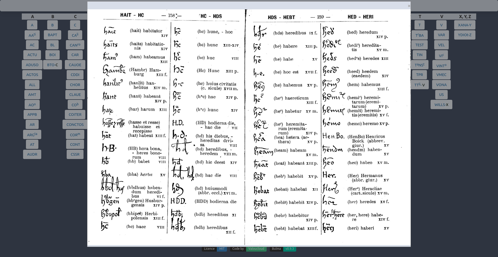

#  cappelli
Site d'aide au développement des abréviations paléographiques en reprenant lee dictionnaire Cappelli : 
_A. CAPPELLI. DIZIONARIO DI ABBREVIATURE LATINE ED ITALIANE. Milano, 1912_

Une application simple est disponible, elle consiste en un script python Qt5 empaqueté avec _pyinstaller_.

Les binaires sont disponibles pour Linux et Windows pour l'instant sur la page [releases](https://github.com/sentis-valentin/cappelli/releases).

Pour Linux, soit téléchargez le fichier compressé [cappelli_linux.tar.xz](https://github.com/sentis-valentin/cappelli/releases/download/v.1.0.0/cappelli_linux.tar.xz), et changez le fichier _Desktop_ selon vos dossier.

Vous pouvez aussi télécharger le fichier [Cappelli-x86_64.AppImage](https://github.com/sentis-valentin/cappelli/releases/download/v.1.0.0/Cappelli-x86_64.AppImage),
et dans le dossier où ce situe le fichier, ouvrez le terminal et copiez le code ci-dessous :
````
chmod +x Cappelli-x86_64.AppImage && ./Cappelli-x86_64.AppImage
````
Pour Windows, téléchargez [cappelli_windows.exe](https://github.com/sentis-valentin/cappelli/releases/download/v.1.0.0/cappelli_windows.exe), et l'ouvrir comme n'importe quelle application.

Sous Linux, pour compiler le script python et utiliser le code, télécharger _main.py_, et en se mettant dans le dossier où se trouve le fichier :
````
sudo apt install python3 && pip install -r requirements.txt && python3 main.py
````



